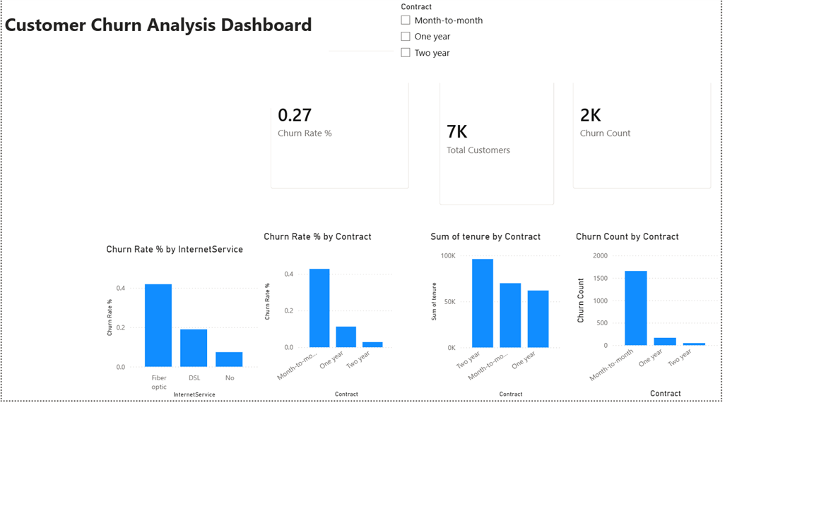

# Customer-Churn-Analysis-PowerBI
Customer churn analysis dashboard built using Power BI to identify churn trends and customer retention insights.
# Customer Churn Analysis Dashboard

Interactive Power BI dashboard analyzing customer churn patterns using the Telco Customer Churn dataset from Kaggle.

## 📊 Overview
This dashboard identifies key drivers of customer churn to help telecom businesses reduce attrition and improve retention strategies.

## 🎯 Key Insights
- **Overall churn rate: 27%** across 7,043 customers
- **Month-to-month contracts** have the highest churn rate compared to one-year and two-year contracts
- **Fiber optic internet service** customers churn significantly more than DSL or no-internet customers
- Customers with **shorter tenure** are more likely to churn

## 🛠️ Tools Used
- Power BI Desktop
- DAX (Data Analysis Expressions) for custom measures
- Power Query for data transformation

## 📈 Dashboard Features
- KPI cards: Churn Rate %, Total Customers, Churn Count
- Churn Rate % by Contract Type
- Churn Rate % by Internet Service
- Sum of Tenure by Contract
- Interactive Contract slicer for filtering

## 📁 Dataset
Dataset used: [Telco Customer Churn Dataset](https://www.kaggle.com/datasets/blastchar/telco-customer-churn) (sourced from Kaggle)

## 📸 Screenshot





## 🔍 Key DAX Measure
```dax
Churn Count = CALCULATE(COUNTROWS('WA_Fn-UseC_-Telco-Customer-Churn'), 
              'WA_Fn-UseC_-Telco-Customer-Churn'[Churn] = "Yes")
